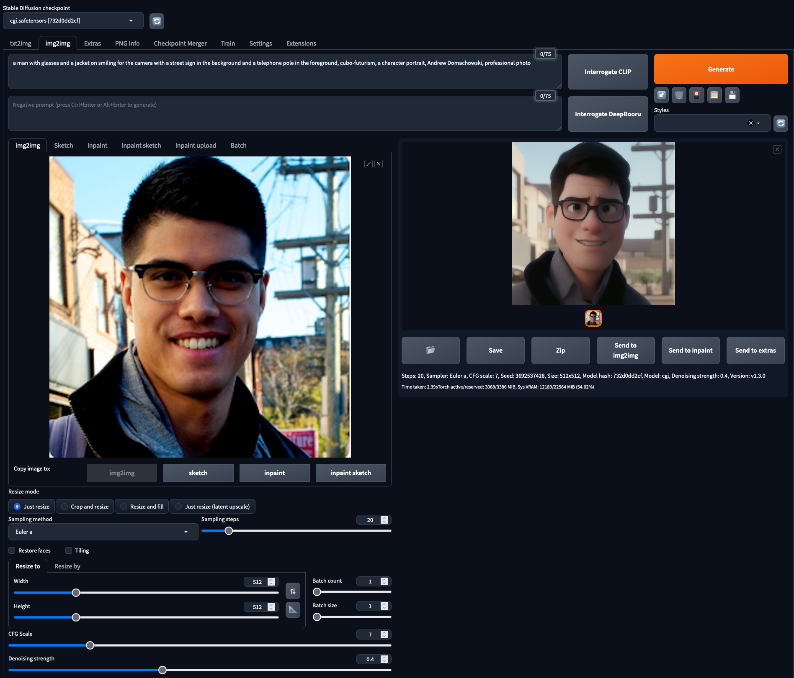
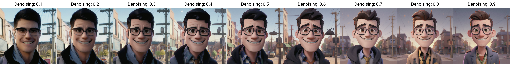
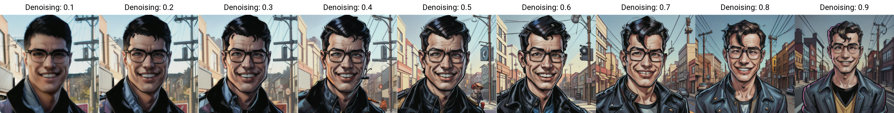
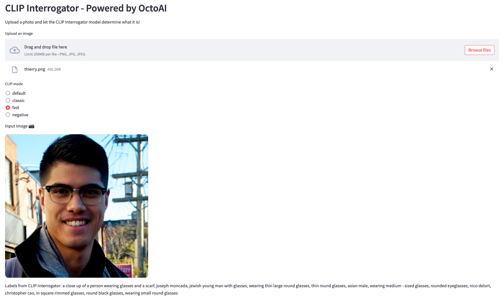
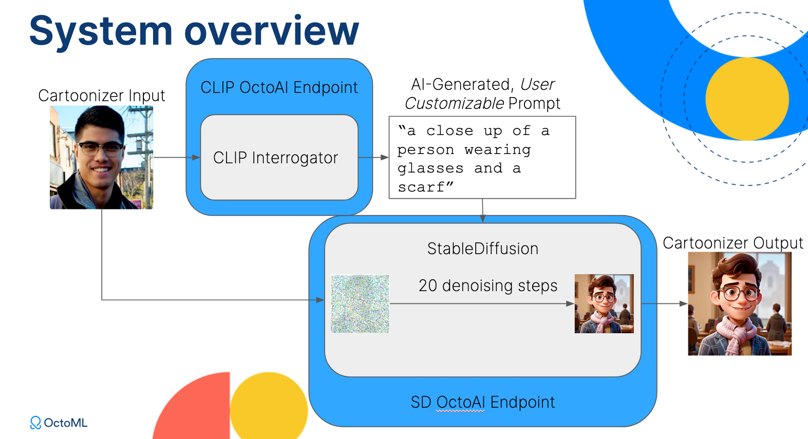
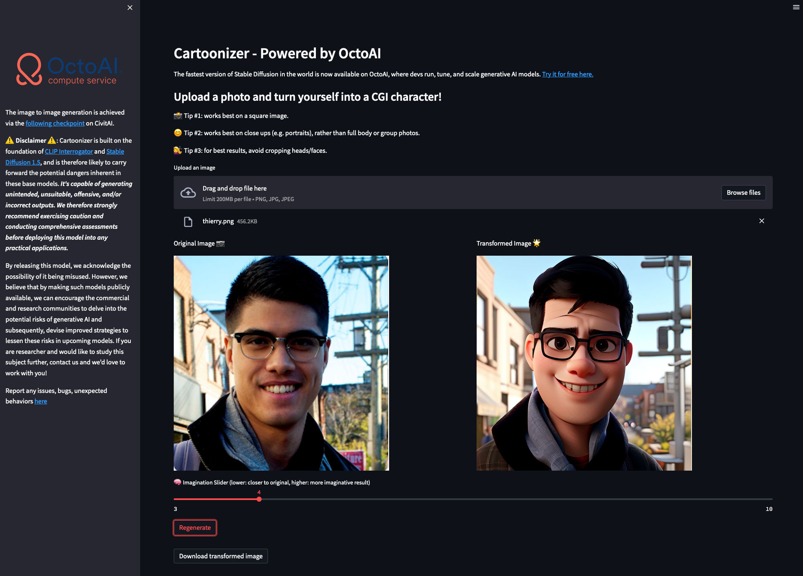

# OctoAI: Cartoonizer Tutorial :camera::star2::octopus:

In this guide you'll learn how to build, deploy and share your own interactive and engaging image-to-image Generative AI web-application using the newly launched OctoAI compute services!


[Video Walkthrough Link](https://drive.google.com/file/d/1FCHIvKC13xqLgKOF33pF2lWYD5EIsf1u/view?usp=sharing)

## Requirements :clipboard:

Let's take a look at the requirements in terms of skill set, hardware and software for each phase of this tutorial.

In total this tutorial takes 30mins - 1 hour, depending on how much programming experience you have and how much you want to experiment with stable diffusion functionality. Note that we've designed this tutorial to be as approachable as possible. Very minimal programming experience is required here to be successful.

### Phase 1: Experiment with Image to Image feature in Stable Diffusion Web UI :woman::arrow_right::princess:

#### Time :clock1:
* 5-30mins depending on how much you want to experiment with Stable Diffusion.

#### Skillset :hatching_chick:
* Creativity!

#### Software :floppy_disk:
* A model checkpoint of your choice from [CivitAI's website](https://civitai.com/).
* An image of your choice.


### Phase 2: Clone a production-grade Stable Diffusion and CLIP endpoint on OctoAI :octopus:

#### Time :clock1230:
* 5 mins

#### Skillset :hatching_chick:
* No experience needed to launch the OctoAI endpoint. Beginner-level command line programming for testing.

#### Hardware :computer:
* Your laptop.

#### Software :floppy_disk:
* [OctoAI's compute service](https://docs.octoai.cloud/docs) with a user account.

### Phase 3: Build your own Streamlit Web Frontend :technologist:

#### Time :clock1230:
* 15-30 mins.

#### Skillset :hatching_chick:
* No web-design experience needed! Beginner-level Python programming.

#### Hardware :computer:
* Your laptop for developing your webapp, a laptop or phone/tablet to test the webapp.

#### Software :floppy_disk:
* [Streamlit](https://streamlit.io/) library that you can pip-install.
* The OctoAI inference endpoint URLs that you launched in Phase 3.

## Disclaimer

Disclaimer: "Cartoonizer" is built on the foundation of CLIP Interrogator and Stable Diffusion 1.5, and is therefore likely to carry forward the potential dangers inherent in these base models. It's capable of generating unintended, unsuitable, offensive, and/or incorrect outputs. We therefore strongly recommend exercising caution and conducting comprehensive assessments before deploying this model into any practical applications.

By releasing this model, we acknowledge the possibility of it being misused. However, we believe that by making such models publicly available, we can encourage the commercial and research communities to delve into the potential risks of generative AI and subsequently, devise improved strategies to lessen these risks in upcoming models. If you are researcher and would like to study this subject further, contact us and we’d love to work with you!

## Step-by-step Cartoonizer Tutorial :books:

### Phase 1: Experiment with Image to Image feature in Stable Diffusion Web UI :woman::arrow_right::princess:

There is a huge community of stable diffusion enthusiasts out there so whether you find your information on Reddit, youtube, or GitHub, you're sure to find quality content.

I learned how to use Stable diffusion's image to image feature on Youtube actually thanks to the following [video](https://www.youtube.com/watch?v=dSn_vXrjaK8).

You'll find that the community of stable diffusion enthusiasts gravitate around [AUTOMATIC1111's Stable Diffusion Web UI tool](https://github.com/AUTOMATIC1111/stable-diffusion-webui). You'll find that it's a pretty easy tool to onboard with. 

To launch the web UI on OctoAI and download your custom checkpoint/style from CivitAI into the web UI, follow these [docs](https://docs.octoai.cloud/docs/automatic1111).



Select under `Stable Diffusion checkpoint` the model file that you downloaded under `stable-diffusion-webui/models/Stable-diffusion/`. This will determine the style you get on the output image.

Start by uploading a photo of your choice. In order for image to image to work well, you'll need to provide a textual description of the image you upload under the prompt. This is because Stable Diffusion requires test in order to guide the image that it generates. It would be very cumbersome to have to describe each picture we upload manually, so instead we can use the `Interrogate CLIP` button which invokes a CLIP Interrogator model. This essentially performs the reverse of Stable Diffusion's text-to-image: from an image, it gives you text.

Once you've interrogated the CLIP model, you will be able to see what it has inferred from the image you uploaded. Now you can hit the "Generate" button to see what image it has generated.

It should look pretty convincing overall. But you can spend a lot of time in the GUI to tweak several settings. Starting with `Denoising strength` which you can scale down or up to see how it impacts the generated image. Give it a try!

If you're tired hitting generate button after setting a knob to a different value, you can use the handy `X/Y/Z plot` under the `Script` pull down menu. This lets you sweep across different parameters easily to study the effect these parameters have on your generated image. 

For instance you can set `X type` to `Denoising` and under `X values` sweep values from 0.1 to 0.9 in +0.1 increments by entering `0.1-0.9(+0.1)`. Hit generate and see what you get! You can explore up to 3 parameters in this fashion, really handy!



Load a different checkpoint with a different style and see how it affects the output image sweeps!



Hopefully by playing around long enough with the Stable Diffusion Web UI, you can build really good intuition on how Stable Diffusion works, and build some very neat media. We're going to use that knowledge back into our web app to design a simple, single-shot "Cartoonizer" app.

### Phase 2: Get a production-grade Stable Diffusion and CLIP endpoint on OctoAI :octopus:
Go to the [OctoAI compute service website](https://octoai.cloud/). Hit `Login` at the bottom left of the page and log in with your preferred authentication method (email, Google or GitHub).

Then, on OctoAI's [templates page](https://octoai.cloud/templates), you'll be able to find a Stable Diffusion quickstart template for Text to Image Generation as well as a CLIP template for Image Captioning. 

Because Stable Diffusion is hosted as a quickstart template, you can immediately run inferences on it for free without waiting for cold start. Simply click on the Stable Diffusion template:  That will bring you to a page with a demo, endpoint URL, and an example CURL command on how to use the endpoint:  

Copy down the endpoint URL, which we will use later in this tutorial.


Next, go back to the [templates page](https://octoai.cloud/templates), locate the CLIP template for Image Captioning, and click the clone button next to it.


When cloning a template, you can set a custom name, minimum hardware replicas, maximum hardware replicas, and privacy setting for your endpoint. If you want to learn more about these parameters, click on the tooltips next to each parameter. 


After you click Clone, you'll see a new page for your endpoint, where you can once again locate the endpoint URL and copy it down for use later. 
- This `/predict` route at this endpoint URL will run inferences that create captions for images. The route takes in a JSON input, which contains an `image: base-64 encoded image` and a `mode: string` key-value pair. The mode string can be one of `fast`, `classic`, `negative` and `default` which provide different [interrogation modes](https://github.com/pharmapsychotic/clip-interrogator/blob/main/clip_interrogator/clip_interrogator.py#L205-L255) offered by the CLIP interrogator. 

| Mode | Explanation|
|------|------------|
| Fast mode | Simply adds the top ranked terms after a caption. It generally results in better similarity between generated prompt and image than classic mode, but the prompts are less readable. |
| Classic mode | Creates a prompt in a standard format first describing the image, then listing the artist, trending, movement, and flavor text modifiers. |
| Negative mode | Chains together the most dissimilar terms to the image. It can be used to help build a negative prompt to pair with the regular positive prompt and often improve the results of generated images particularly with Stable Diffusion 2. |
| Default mode | Default interrogation mode. |

- The `/predict` route returns an output dictionary that contains an `labels: label_string` key-value pair.


As a sanity check, we can try an inference on this CLIP endpoint, and confirm that we got a JSON output that we expected:
```
curl -X POST "https://clip-demo-23ao26kvg603.octoai.cloud/predict"  -H "content-type: application/json" --data-raw '{"image": "", "mode": "classic”}'
```


### Phase 3: Build your own Streamlit Web Apps

Yes, we have our AI endpoints up! Time to build our web app! No web design experience? No problem. All you need is a bit of Python experience, thanks to the Streamlit library that lets you quickly build simple web apps and host them for free as long as you host your source code on a public GitHub repo. You'll need to create a [Streamlit](https://streamlit.io/) account.

We're going to build our web app in two stages. First we're going to test an interactive CLIP-Interrogator web app that lets us upload an image and see how the AI labels it. Second, we'll build our Cartoonizer web app that will turn images that you upload into a cartoon version of yourself.

#### A. A simple interactive CLIP-Interrogator frontend :technologist:

You can get all of the code you need to have that frontend up and running under [websites/clip_interrogator/](websites/clip_interrogator/). But to build it from scratch, follow the instructions below:

On your laptop or preferred development machine, set up your python environment so we can install Streamlit.

```bash
cd $MY_CLIP_TEST_DIRECTORY
python3 -m venv .venv
source .venv/bin/activate
```

Now install the pip packages you need to test your CLIP-Interrogator web app.

```bash
pip3 install streamlit
pip3 install Pillow
```

Let's create a Python file that implements our interactive web app using Streamlit, and we'll call it `clip_interrogator.py`. In under 50 lines of code, you can build a web app that lets you set the mode of the interrogation of the CLIP-Interrogator model, upload an image, process it to be sent to the CLIP-Interrogator OctoAI inference endpoint, and display the label that endpoint returns! Note that some modes will be significantly slower to run than others. If you want fast processing times, I suggest you stick to `fast` mode.

```python
import streamlit as st
from PIL import Image
from io import BytesIO
from base64 import b64encode
import requests

def run_clip_interrogator(upload, mode):
    # Input image that the user is uploading
    input_img = Image.open(upload)
    # Apply cropping and resizing to work on a square image
    st.write("Input Image :camera:")
    st.image(input_img)
    # Prepare the JSON query to send to OctoAI's inference endpoint
    buffer = BytesIO()
    input_img.save(buffer, format="png")
    image_out_bytes = buffer.getvalue()
    image_out_b64 = b64encode(image_out_bytes)
    model_request = {
        "image": image_out_b64.decode("utf8"),
        "mode": mode
    }
    # Send the model request!
    reply = requests.post(
        f"https://clip-interrogator-4jkxk521l3v1.octoai.cloud/predict",
        headers={"Content-Type": "application/json"},
        json=model_request
    )
    # Print the labels returned by the inference endpoint
    labels =reply.json()["completion"]["labels"]
    st.write("Labels from CLIP-Interrogator: {}".format(labels))

# The Webpage
st.set_page_config(layout="wide", page_title="CLIP Interrogator")
st.write("## CLIP Interrogator - Powered by OctoAI")
st.markdown(
    "Select a mode, upload a photo and let the CLIP Interrogator model determine what it sees in it!"
)
# User-controllable radio dials to select CLIP interrogator mode
mode = st.radio(
        'CLIP mode',
        ("default", "classic", "fast", "negative"))
# Upload button to upload your photo
my_upload = st.file_uploader("Upload an image", type=["png", "jpg", "jpeg"])

if my_upload is not None:
    run_clip_interrogator(my_upload, mode)
```

Now that you've saved your Python file, you can test it on your local browser by just running the following command in the directory that contains the `clip-interrogator.py` file.

```bash
streamlit run clip_interrogator.py
```

Assuming you're not SSH-ed into the machine you run this from, Streamlit will automatically run your page in the browser. If you're SSHing into the machine Streamlit will give you a Local and Network URL you can access from your browser assuming the machine firewall allows external connections through the ports used by Streamlit.

Select your CLIP Interrogator mode, upload a picture of your choice, and feel the power of offloading all of that heavy AI compute to the OctoAI compute service. Neat!



Next we'll build the full Cartoonizer app by invoking both CLIP-Interrogator and Stable-Diffusion OctoAI endpoints from within your web app.


#### B. The Cartoonizer Web App :camera::star2::octopus:

Now we're going to build the Cartoonizer frontend - the code build with Streamlit is available under [websites/cartoonizer/](websites/cartoonizer/).

A few explanations:

We now have two endpoints which are serving the CLIP-Interrogator model on one hand, and the Stable Diffusion model on the other.
```python
CLIP_ENDPOINT = "https://cartoonizer-clip-test-4jkxk521l3v1.octoai.cloud"
SD_ENDPOINT = "https://cartoonizer-sd-test-4jkxk521l3v1.octoai.cloud/predict"
```

As shown in the Cartoonizer diagram below, call the CLIP-Interrogator model in the first place to generate a text prompt that describes the input image, which then gets fed into Stable Diffusion along with the input image to perform image to image generation.



We also introduce an "imagination slider" in the Web app with the code below, which allows the user to control the denoising strength when generating an image.

```python
strength = st.slider(
    ":brain: Imagination Slider (lower: closer to original, higher: more imaginative result)",
    3, 10, 5)
```

And finally, we also provide a "regenerate button" that lets us generate a new image based on a new seed.

```python
seed = 0
if st.button('Regenerate'):
    seed = random.randint(0, 1024)
```

Whenever a user uploads a new image, the image (1) gets rotated depending on the presence of specific EXIF data (this is useful if that image comes straight from your smartphone camera), (2) gets cropped and resized to a 512 by 512 image to make the generate image always match the input image dimensions, and (3) gets converted into a base64 encoding so it can be easily sent over to our inference endpoints.

First, the image gets sent to the CLIP-Interrogator inference endpoint in order to obtain a prompt. Second, send that prompt along with the image data, and Stable Diffusion parameters such as denoising strength over to the Stable Diffusion endpoint to get a Cartoonized image back!

We can finally display the image and offer the option from the end user to download the image. Here's the Cartoonizer app in action! 



#### C. Hosting your webpage publicly using Streamlit

Now that you've been able to successfully test out your web app locally, time to launch it to production! What you'll need to do is create a public GitHub repo that contains the `cartoonizer.py` file.

You'll need to create a Streamlit account - which is free. Once you're logged into Streamlit, you can go to the [landing page](https://share.streamlit.io/), and create a new app.

Here you just need to point to the repo, branch and file path that you want Streamlit to host - and all you have to do is hit `Deploy!`


Within a couple of minutes you have a URL that you can personalize, and share with your friends, colleagues and family!

## Conclusion

I hope that this guide will inspire you to unleash your creativity and build a really neat app that you can feel proud to share with your closest friends and family!

Note that many of these models have been trained on incomplete datasets. The likelihood of these models exhibiting bias is very strong. Please handle open source models with care as results and outcomes can be surprising, or even at times shocking and offensive. We have a responsibility as developers to build systems that are not harmful to others. If your app leads to unexpected behavior, use that as an opportunity to create a healthy discussion around the use of cutting edge AI models, and reach out to people working on AI ethics to discuss solutions to the problems you encounter.

With that, be responsible and have fun!

Please don't hesitate to share feedback, bugs or issues under: https://github.com/tmoreau89/octoai-cartoonizer/issues

Or got ideas for things you'd like to build? Shoot me an email at tmoreau@octoml.ai. Cheers. :beers:
